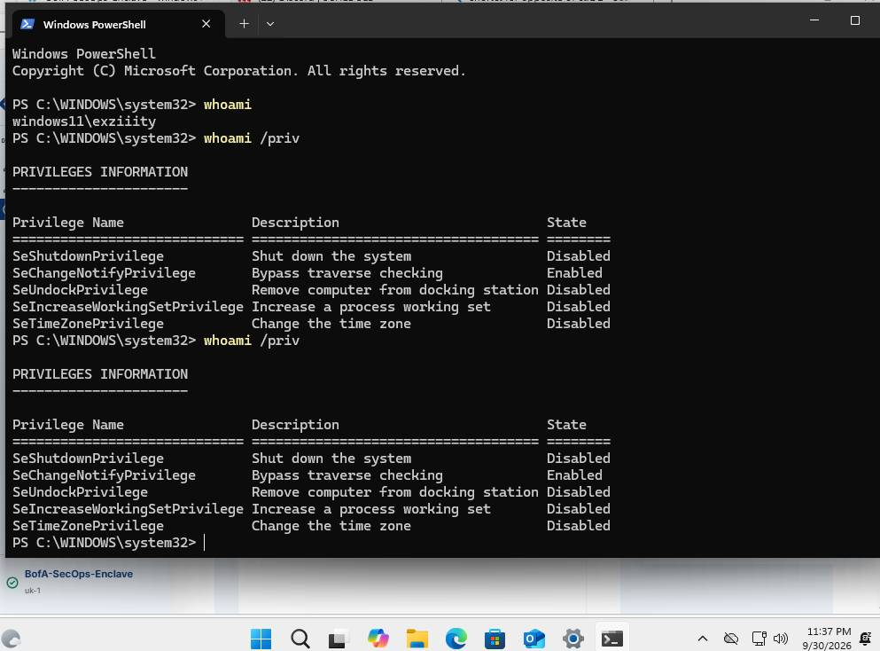
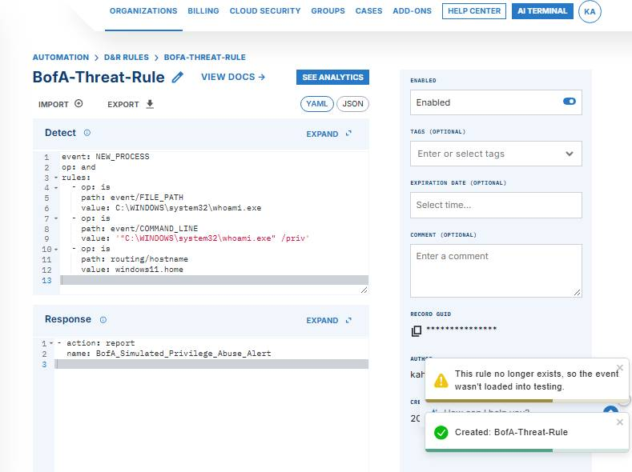
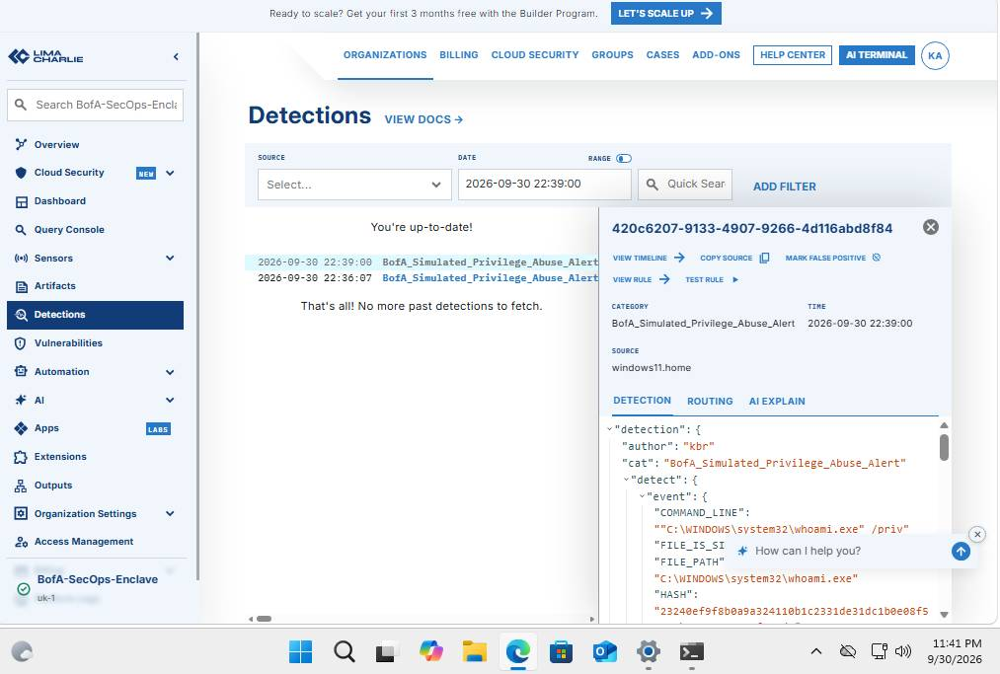

# My Cybersecurity Engineering Portfolio

This repository hosts a personal project I built to understand enterprise visibility, log ingestion, and detection engineering. I wanted to move past basic theory and build a lab that mimics how real Security Operations (SecOps) teams monitor networks and catch malicious activity.

---

## Enterprise EDR Telemetry & Detection Engineering Lab

### Project Breakdown
In a corporate banking environment, security teams need deep visibility to catch attackers before they can move laterally through a network. This lab focuses on setting up a real-time event logging pipeline, analyzing endpoint telemetry data, and writing custom detection rules from scratch.

* **Target System:** Sandboxed Windows 11 Virtual Machine (Hosted via Oracle VirtualBox)
* **EDR Agent:** Kernel-level cloud-native Endpoint Detection & Response (EDR) Agent via LimaCharlie
* **Log Analytics Engine:** Cloud Event Ingestion Platform & Data Pipeline
* **Framework Correlation:** MITRE ATT&CK Framework Tactics and Techniques

---

### How I Built It

#### 1. Deploying the EDR Pipeline
I started by setting up a cloud security organization tenant named `BofA-SecOps-Enclave`. To get telemetry streaming from my Windows 11 VM, I generated an installation key and deployed a lightweight sensor agent using an administrative PowerShell terminal. This established a live, continuous feed tracking processes, file mutations, and network sockets from the operating system directly to my cloud console.

#### 2. Running an Attacker Simulation
To test the environment's visibility, I simulated a common post-exploitation technique used during adversary reconnaissance phases. Inside the Windows terminal, I ran:
```powershell
whoami /priv
```
Attackers frequently run this discovery command immediately after gaining access to check their privilege levels and map out potential paths for privilege escalation.

#### 3. Log Ingestion & Custom Rule Design
Once the command was executed, I jumped over to the live telemetry stream to inspect the raw log data. I isolated the process creation event and analyzed its raw JSON configuration string, picking out the process path (`C:\WINDOWS\system32\whoami.exe`) and the explicit command line arguments used.

Using this information, I built a custom Detection and Response (D&R) rule using specific string matching to flag unauthorized system discovery behaviors without disrupting standard user behavior.

#### 4. Testing & Catching the Exploit
After deploying the new rule to the cloud engine, I ran the simulation command inside the Windows VM again. The detection engine successfully intercepted the process creation event, matched my custom logic parameters, and instantly fired a live alert (`BofA_Simulated_Privilege_Abuse_Alert`) straight to my security dashboard, complete with the full JSON metadata for incident analysis.

---

### Practical Validation Evidence

#### Phase 1: Running the Attacker Simulation
*Verifying endpoint execution. This screenshot shows the local terminal processing the privilege audit command.*



#### Phase 2: Building the Detection Rule
*Configuring the logic. This screenshot shows my custom YAML/JSON rule structure saved successfully into the detection console.*



#### Phase 3: The Live Alert Capture
*Validating the defense loop. The main dashboard catches the activity and logs the high-fidelity alert live.*




---

## Lab 2: Enterprise Web Server Threat Hunting & Log Analytics

### Project Breakdown
Public-facing web portals across financial institutions represent significant attack surfaces subjected to continuous automated exploitation scanning. This project focuses on configuring an enterprise Linux web service runtime baseline, simulating an advanced web application vulnerability exploit (SQL Injection), and executing command-line string analytics to perform proactive threat identification using my Year 1 knowledge of HTTP protocols.

* Target Asset: Nginx Enterprise Web Infrastructure Instance (Ubuntu Runtime Environment)
* Ingestion Target: Native HTTP Application Architecture Access Logs (access.log)
* Analytics Toolset: Bash Core Shell Scripting, Regular Expression Filters (grep, awk, sort, uniq)
* Analyst Objective: Isolate active exploit signatures, verify backend payload execution statuses, and parse malicious traffic matrices.

---

### How I Built It

#### 1. Deploying the Web Ingestion Service
I provisioned and initialized a native production-style Nginx web architecture layer across an isolated Linux target asset. This established standard network socket binding protocols over default HTTP interface ports and initialized granular transaction logging formats to map incoming network frames.

#### 2. Simulating Application-Layer Web Exploitations
Acting as an external threat actor performing application-layer reconnaissance, I generated a synthetic attack traffic loop aimed at exposing common web application logic flows. I formulated an unauthenticated administrative authentication bypass string ('--OR+1=1) to exploit inputs via native terminal commands.

#### 3. Engineering the Log Analysis and Threat Hunting Pipeline
Switching to a Blue Team Network Analyst framework, I engineered a series of multi-stage Bash analytics filters to parse the server's raw application access log streams (/var/log/nginx/access.log). Using regular expressions, I isolated malicious traffic signatures from benign user transactions. I then constructed an awk processing sequence to parse the fields of the unstructured log text, extracting the exact source IP addresses, HTTP command strings, requested endpoint paths, and subsequent server status codes ($1, $6, $7, $9).

---

### Technical Validation Evidence

#### Phase 1: Analyzing the Attack Success Status (HTTP 404 Verification)
What I learned from my Year 1 Web and Networking modules is that every server returns a status code for a request. This terminal screenshot captures my script finding the attack string. Because the server returned a '404 Not Found' status code, it proves that while the attacker successfully sent the SQL injection attempt, the attack failed because they targeted a web path that doesn't exist on my server.


